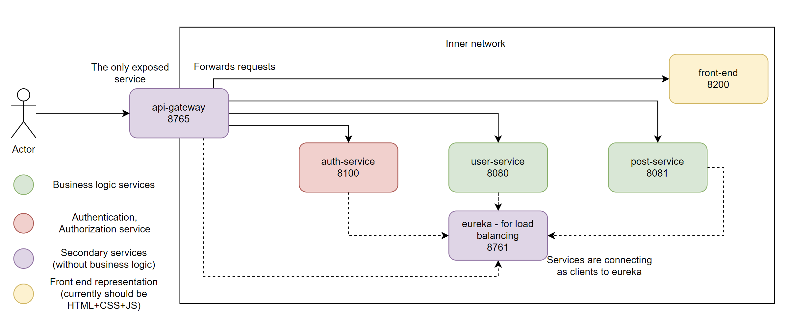

# microservices-feign

**Current implementation**:

  

**auth-service**:

/api/v1/auth/** accessible to everyone

/actuator/** only to admins

User registers here, logs in and verifies token given after registration or log in action.

  

**user-service**:

/api/v1/user/** POST to authenticated, get to EVERYONE

/actuator/** only to admins

POST requests to user service available only to authenticated users(with tokens). Users can create their profile here and also follow or unfollow other users. (/api/v1/users/{currentUserId}/(un)follow/{otherUserId})

  

**post-service**:

/api/v1/posts/** POST to authenticated, get to EVERYONE

/actuator/** only to admins

POST requests to post service available only to authenticated users(with tokens). Users can create posts and comment them using this service.

NOTE: post that has parent post is considered as comment to a parent post.

That allows to easily implement comments and comments for those comments and so on.

Also likes are implemented both for comments and for posts

/api/v1/post{id}/likes - will return likes of specific post

/api/v1/post{id}/likes/quantity - will return likes quantity of specific post

  

**api-gateway**:

Routes following endpoints to associated services:

FROM post/api/v1/posts/**, post/api/v1/comment/** - TO api/v1/posts/**, api/v1/comment/**

FROM user/api/v1/users/** TO api/v1/users/**

FROM auth/api/v1/auth/** TO api/v1/auth/**

  

**eureka**:

Used for load balancing.

  

**front-end**:

No implementation for now, just to see full picture of architecture

In docker only api-gatewatay is available, we cannot directly access any other services.
